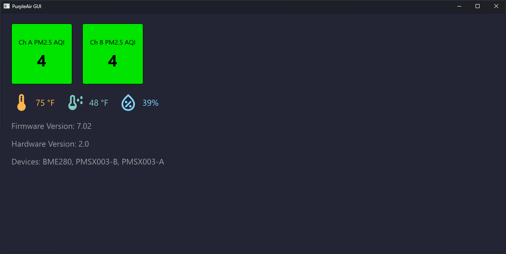

# PurpleAir GUI

To use this, update the `device_url` file with the IP address of your PurpleAir device.  
This app only works when connected to the same local network as the sensor.

> ⚠️ **Note:** This has only been tested with the [PurpleAir PA-II](https://www2.purpleair.com/products/purpleair-pa-ii) model.

---

